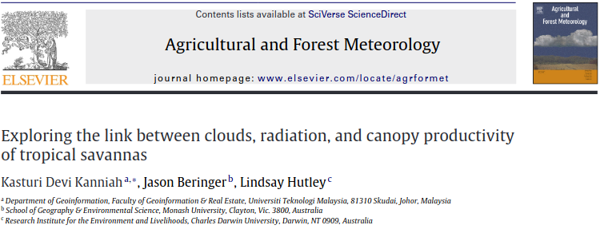

class: top, center

```{r setup, include=FALSE}
options(htmltools.dir.version = FALSE)
```

```{r webcam, echo=FALSE, include= TRUE}
xaringanExtra::use_webcam()
```

```{r xaringan_themes, echo = FALSE, include=FALSE}
	names(xaringan:::list_css())
```

```{r broadcast, echo=FALSE}
xaringanExtra::use_broadcast()
```

background-image: url("https://s1.static.brasilescola.uol.com.br/be/conteudo/images/d7b44e0470bbe892e8ffec9046a26d10.jpg")

# Sumário

.left[
1. Conceitos;

2. Fatores abióticos limitantes;

3. Solo;

4. Clima;

5. Relação com fatores bióticos

6. Atividade proposta.
]

???
Nesta aula, falaremos sobre as condições ambientais e sua relação com a fauna e a flora.
---
class: top,center

# O que são fatores abióticos?

--


### Fatores abióticos são os elementos [não vivos](https://www.sciencedirect.com/topics/earth-and-planetary-sciences/abiotic-factor) do ambiente. 

--

.left-column[

- Solo*
- Água
- Rochas
- Luz
- Vento
- Gases atmosféricos
]

--

.right-column[

]

---
class: top, center

# O que são [Condições ambientais](https://edisciplinas.usp.br/mod/book/view.php?id=2438629&chapterid=20711)?

--

- São características físicas e químicas do ambiente. [Townsend et al., 2010](https://moodle.ufsc.br/mod/resource/view.php?id=4130181) 

--

- São fatores abióticos do ambiente que influenciam no funcionamento dos organismos. [Begon et al., 2007](http://www.esalq.usp.br/lepse/imgs/conteudo_thumb/Ecology-From-Individuals-to-Ecosystems-by-Michael-Begon--2006-.pdf)

--


_Imagem tirada de <https://sciencing.com>_

---
class: top, left

.center[# Quiz `r emo::ji('question')`

### Qual a diferença entre <u>condições ambientais</u> e <u>recursos?</u>
]

--

#### - Os recursos se esgotam, as condições não. 

--

#### - O que não quer dizer que as condições não se modificam com o tempo.

---
class: top, left

## Fatores abióticos limitantes

- São fatores que limitam o tamanho das populações e podem limitar ou diminuir o seu crescimento.

 _Curvas de resposta dos organismos às condições ambientais._
---
class: top, left

## Fatores abióticos limitantes

- **Água:** Possui elementos inorgânicos dissolvidos; equilíbrio hosmótico dos organismos aquáticos; dissecação nos terrestres;

- Elevado [calor específico](https://pt.wikipedia.org/wiki/Calor_espec%C3%ADfico) e [calor latente](https://pt.wikipedia.org/wiki/Calor_latente)

.center[


_Fonte da imagem: Wikipedia_] 

---
class: top, left

## Fatores abióticos limitantes

- **Temperatura:** Efeito em processos biológicos. Maioria dos animais não regula a temperatura corporal;

- Entre 0 ºC e 45 ºC. Fora deste intervalo: Extremófilos

- Endotérmicos: Regulam a própria temperatura. Possível vantagem adaptativa dos mamíferos contra fungos. [Bergman & Casadevall, 2010](https://journals.asm.org/doi/full/10.1128/mbio.00212-10)

- Ectotérmicos: Não possuem mecanismo que regule sua própria temperatura

.center[

]

_Fonte da imagem: [Britannia](https://www.britannica.com/science/biosphere/Environmental-conditions)_
---
class: top, left

## Fatores abióticos limitantes

- **Luz solar:** Provê energia aos produtores primários; Fotoperíodo

.center[

]
---
class: top, left

## Fatores abióticos limitantes

- **Vento:** Aumenta calor e perda de água; 

- Déficit de pressão de vapor (VPD)


.center[   

  
  _Fontes: [McElrone et al., 2013](https://www.nature.com/scitable/knowledge/library/water-uptake-and-transport-in-vascular-plants-103016037/); [Grossiord et al., 2020](https://nph.onlinelibrary.wiley.com/doi/10.1111/nph.16485)_]
---
class: top, center

## Fatores abióticos limitantes

### **Salinidade** diz respeito à quantidade de sais dissolvidos na água.

.left[- Salinidade mais variável na região costeira

- Regulação osmótica
]


---
class: top, left

## Fatores abióticos limitantes

- o **pH** diz respeito à quantidade de íons de Hidrogênio dissolvidos em água;


.center[
]

---
class: top, left

# [Solo](https://www.embrapa.br/contando-ciencia/solos/-/asset_publisher/1ZCT5VQ5Hj1S/content/o-que-e-e-como-se-forma-o-solo-/1355746?inheritRedirect=false) & [Solo](https://pt.wikipedia.org/wiki/Solo)

- Pedogênese: Diz respeito à formação dos solos. Longo tempo de formação: intemperismo físico, químico e biológico

- Formado de partículas minerais e orgânicas.

- Macronutrientes: N, P, K, Ca, Mg, S.

- Micronutrientes: B, Cl, Cu, Fe, Mn, Mo, Zn, Si e Ni.

.center[]
---
# Granulometria
- Se refere ao tamanha das partículas do solo.

.center[]

---
class: top, center

# Horizontes do solo

.left[
O: O horizonte orgânico do solo e bastante escuro;

A: Horizonte superficial, com bastante interferência do clima e da biomassa;

B: Horizonte de maior concentração de argilas, minerais oriundos de horizontes superiores. É o solo com coloração mais forte, agregação e desenvolvimento;

C: Porção de mistura de solo pouco denso com rochas pouco alteradas da rocha mãe;

R: Rocha matriz não alterada. De difícil acesso em campo.
]


---
class: top, center

# pH do solo controla os processos biogeoquímicos

.right-column[

]

*pH do solo controla:*

- Solubilidade;
- Mobilidade; e
- Disponibilidade de nutrientes para os organismos

_Fonte: [Neina, 2019](https://www.hindawi.com/journals/aess/2019/5794869/)_
---
class: top, center

.left[
# Fertilidade do solo modula estratégia das plantas para lidarem com a seca

- Trade-off entre segurança hidráulica e crescimento
]


_Fonte: [Oliveira et al., 2020](https://nph.onlinelibrary.wiley.com/doi/10.1111/nph.17266)_
---
class: top, center

# Os organismos também influenciam as condições ambientais.

.left-column[
- Retroalimentação entre vegetação e condições ambientais;
]

.right-column[

_Fonte: [Flores et al., 2019](https://link.springer.com/article/10.1007/s11104-019-04097-8)_
]
---
class: tpo, center

## Estrutura da vegetação versus condições ambientais

.left-column[
- Retroalimentação entre vegetação e disturbios.
]

.right-column[

_Fonte: [Flores et al., 2015](https://sci-hub.se/https://doi.org/10.5194/bg-12-5563-2015)_
]
---
class: top, center

## Espécies exóticas mudam estrutura da vegetação
- ...e consequentemente o funcionamento do sistema e as condições

.left-column[

]

.right-column[

]


_Fonte: [Asner et al., 2008](https://www.pnas.org/doi/full/10.1073/pnas.0710811105)_
---
class: top, center

# Os animais também podem mudar o seu ambiente


_Fonte: [Berzaghi et al., 2019](https://www.nature.com/articles/s41561-019-0395-6)_
---
class: top, center

# Outro Exemplo: 

## Campos de murundu
.left-column[


]


.right-column[]

_Fonte: [Ndlovu et a, 2021](https://doi.org/10.1016/J.JTHERBIO.2021.103068)_
---
class: top, left

# Ciclo climático

### Fatores externos:

- Movimentos de rotação e translação: Escala anual e diária;

- Ciclos de períodos médios (décadas/séculos/milênios): Radiação solar;

- Oscilações oceânicas (decadal): Influências planetares e lunares;

- Ciclos longos (10 a 100 mil anos): Mudanças na órbita da Terra. Ciclo de Milankovitch.

.left-column[
 [El niño](http://enos.cptec.inpe.br/) DJF
 [La niña](http://enos.cptec.inpe.br/) DJF
]

.right-column[

_Fonte: [Circulação Global idealizada](http://fisica.ufpr.br/grimm/aposmeteo/cap8/cap8-1.html)_
]
---
# Ciclo climático


### Fatores internos

- Interações entre atmosfera, oceano e superfície do planeta

- Interações bióticas

- Mudanças de origem antrópica na superfície do planeta

.center[


[Albedo](http://sigep.cprm.gov.br/glossario/verbete/albedo.htm)]
---
# Regime de chuvas afeta distribuiçao da vegetação

- Precipitação média, sazonalidade, desvio padrão anual, variação interanual.

.center[


_Fontes: [Ciemer et al., 2019](https://www.nature.com/articles/s41561-019-0312-z); [Hirota et al., 2011](https://www.science.org/doi/10.1126/science.1210657)_
]

---
# Atividade proposta I

- Questão 1: O que são condições ambientais?

- Questão 2: Qual a relação dos seres vivos com as condições ambientais?

- Questão 3: Escolha um ecossistema da Ilha de Santa Catarina e caracterize as condições ambientais citando fatores bióticos e abióticos deste ecossistema? Ex.: mangue, restinga, floresta, praia, costão rochoso.

.center[
]

---
class: top, left

## Mais algumas referências

- Aproveite o material disponível no Moodle da disciplina!

- Busque no [Google](https://google.com), no [Google Acadêmico](https://scholar.google.com/) e no [Portal de Periódicos da Capes](https://www-periodicos-capes-gov-br.ezl.periodicos.capes.gov.br/) por termos específicos.

- [Britannica - Environmental Conditions](https://www.britannica.com/science/biosphere/Environmental-conditions)

- Também há links interessantes nos slides: explore!

---
.center[

# Até a aula que vem! 

## Leia, questione e discuta com os colegas!

<footer><p class="small">

<h3>Contatos:</h3>

<div>
<a href = "mailto:marciobcure@gmail.com"></a>
 <a href="https://instagram.com/marciobcure" target="_blank"></a>
</div>
</p></footer>

]
